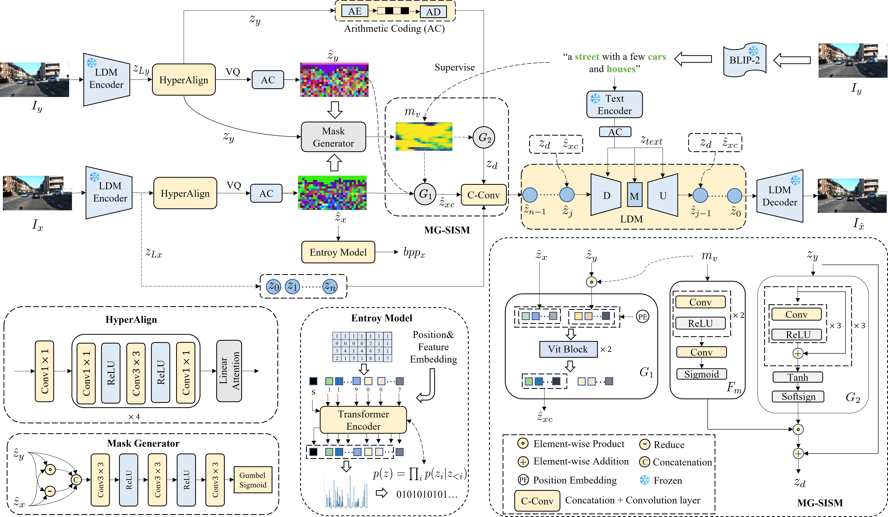

<h1 align="center">
  Distributed Image Compression with 
  Multimodal Side Information <br> at Extremely Low Bitrates
</h1>

<p align="center">
  <b>Guojun Xu</b>, Mingyang Zhang, Jianwen Xiang, Cheng Tan, Yanchao Yang, Junwei Zhou
</p>

<p align="center">
  <i>School of Computer Science and Artificial Intelligence, Wuhan University of Technology</i>
</p>

<p align="center">
  <!-- <a href="https://arxiv.org/abs/xxxx.xxxxx">📄 Paper</a> | -->
  <a href="https://mommqq.github.io/MDIC-proj/">💻 Project Page</a>
</p>

---

## 📖 Overview

Distributed Image Compression (DIC) is crucial for multi-view transmission, especially when operating at extremely low bitrates ($<$ 0.1 bpp). Its core challenge is effectively utilizing side information to achieve high-quality reconstruction under strict bitrate budgets. However, existing DIC approaches struggle to exploit global context and object-level details from side information, leading to local blurring and the loss of fine details in the reconstruction. To address these limitations, we propose a Multimodal DIC framework (MDIC), which, for the first time, leverages side information in a multimodal manner into the DIC paradigm, effectively preserving fine-grained local details and enhancing global perceptual quality in reconstructed images. Specifically, we introduce a text-to-image diffusion-based decoder conditioned on textual side information extracted from correlated images to capture shared global semantics. Moreover, we design a feature-mask generator, supervised by a multimodal fine-grained alignment task, to strengthen the exploitation of visual side information. The generated mask serves two purposes: first, it guides the extraction of fine-grained details from losslessly transmitted side information to preserve the semantic consistency of reconstructed details; second, it regulates the extraction of clustered feature representations from the quantized VQ-VAE embeddings, compensating for category information lost under the extreme compression of the primary image. Extensive experiments on the widely used KITTI Stereo and Cityscapes datasets demonstrate that MDIC achieves state-of-the-art perceptual quality at extremely low bitrates.

---

## ✨ Framework

<!-- You can insert framework figure here -->
<p align="center">
  
</p>

---

## 🛠️ Environment

- Ubuntu 22.04.5 LTS
- Python 3.10.16
- PyTorch 2.3.0 + CUDA 12.1

---

## 📦 Installation

```bash
conda create -n mdic python==3.10
conda activate mdic

pip install -r requirements.txt
````

---

## 📂 Dataset Preparation

We conduct experiments on the **KITTI Stereo** and **Cityscapes** datasets.

### KITTI Stereo

Download the datasets from:

* [KITTI 2012](http://www.cvlibs.net/download.php?file=data_stereo_flow_multiview.zip)
* [KITTI 2015](http://www.cvlibs.net/download.php?file=data_scene_flow_multiview.zip)

After downloading, run:

```bash
# KITTI 2012
unzip data_stereo_flow_multiview.zip
mkdir data_stereo_flow_multiview
mv training data_stereo_flow_multiview
mv testing data_stereo_flow_multiview

# KITTI 2015
unzip data_scene_flow_multiview.zip
mkdir data_scene_flow_multiview
mv training data_scene_flow_multiview
mv testing data_scene_flow_multiview
```

---

### Cityscapes

Download:

* `leftImg8bit_trainvaltest.zip`
* `rightImg8bit_trainvaltest.zip`

from the [Cityscapes official website](https://www.cityscapes-dataset.com/downloads/).

Then run:

```bash
mkdir cityscape_dataset

unzip leftImg8bit_trainvaltest.zip
mv leftImg8bit cityscape_dataset

unzip rightImg8bit_trainvaltest.zip
mv rightImg8bit cityscape_dataset
```

---

## 🚀 Training

Example training command on **Cityscapes**:

```bash
CUDA_VISIBLE_DEVICES=0 python src/train_sd_perco_2.py \
  --pretrained_model_name_or_path 'stable-diffusion-2-1' \
  --validation_frequency 5 \
  --allow_tf32 \
  --dataloader_num_workers 4 \
  --resolution 512 \
  --center_crop \
  --random_flip \
  --train_batch_size 4 \
  --gradient_accumulation_steps 1 \
  --num_train_epochs 50000 \
  --max_train_steps 500 \
  --validation_steps 500 \
  --prediction_type v_prediction \
  --checkpointing_steps 500 \
  --learning_rate 8e-05 \
  --adam_weight_decay 1e-2 \
  --max_grad_norm 1 \
  --lr_scheduler constant_with_warmup \
  --lr_warmup_steps 10000 \
  --checkpoints_total_limit 2 \
  --dataset_name_KC Cityscape \
  --dataset_path ./cityscape_dataset \
  --output_dir PATH/result \
  --resume_from_checkpoint PATH/checkpoint.pt
```

---

### Pretrained Weights

For diffusion-related pretrained weights and model downloads, please refer to the official PerCo repository:

- PerCo Repository: https://github.com/Nikolai10/PerCo

We follow the same setup and pretrained model configuration as the PerCo baseline.


## 🙏 Acknowledgements

Our implementation is built upon the excellent work of **PerCo**.
We sincerely thank the authors for open-sourcing their code and contributions to perceptual compression research.

* PerCo Paper: [https://arxiv.org/abs/2310.10325](https://arxiv.org/abs/2310.10325)
* PerCo Project: [https://github.com/Nikolai10/PerCo](https://github.com/Nikolai10/PerCo)

---

## 📌 Citation

If you find our work useful for your research, please consider citing:

```bibtex
@inproceedings{xu2026mdic,
  title={Distributed Image Compression with Multimodal Side Information at Extremely Low Bitrates},
  author={Xu, Guojun and Zhang, Mingyang and Xiang, Jianwen and Tan, Cheng and Yang, Yanchao and Zhou, Junwei},
  booktitle={Proceedings of the IEEE/CVF Conference on Computer Vision and Pattern Recognition (CVPR)},
  year={2026}
}
```

---

## ⭐ Star Us

If you like this project, please give us a ⭐ on GitHub!

```
```
